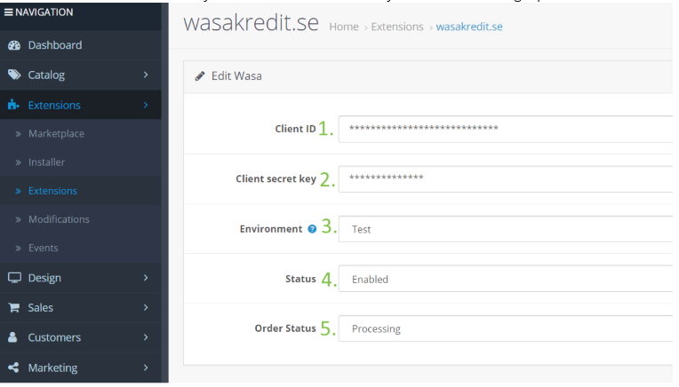

# Wasa Kredit Payment Opencart Installation Guide

1. Download corresponding version from <https://www.opencart.com/index.php?route=marketplace/extension/info&extension_id=36742>
2. Extract content of the zip file
3. Prepare FTP access to your eshop
4. Upload the content of /upload directory to the root of your shop via FTP
5. Now you need to login to your shop administration and enable Wasa payment via Extensions -> payments

6. When module is installed and you are in its administration, you can see following input fields

   1. Client ID - Please contact Wasa Kredit company for this information
   2. Client secret key - Please contact Wasa Kredit company for this information
   3. Environment - In case you want to create test order with Wasa payment first, in other cases select **Live**
   4. Status - Enable Wasa payment in opencart
   5. Order status - Select which status should be set for new order in Wasa payment. I suggest **Processing**

## Monthly Price Widget

Read the following guides on how to display monthly price widget depending on your installed version of OpenCart:
- [wasa\_2.3.x/upload/readme.txt](wasa_2.3.x/upload/readme.txt)
- [wasa\_2.x.x/upload/readme.txt](wasa_2.x.x/upload/readme.txt)
- [wasa\_3.x.x/upload/readme.txt](wasa_3.x.x/upload/readme.txt)
